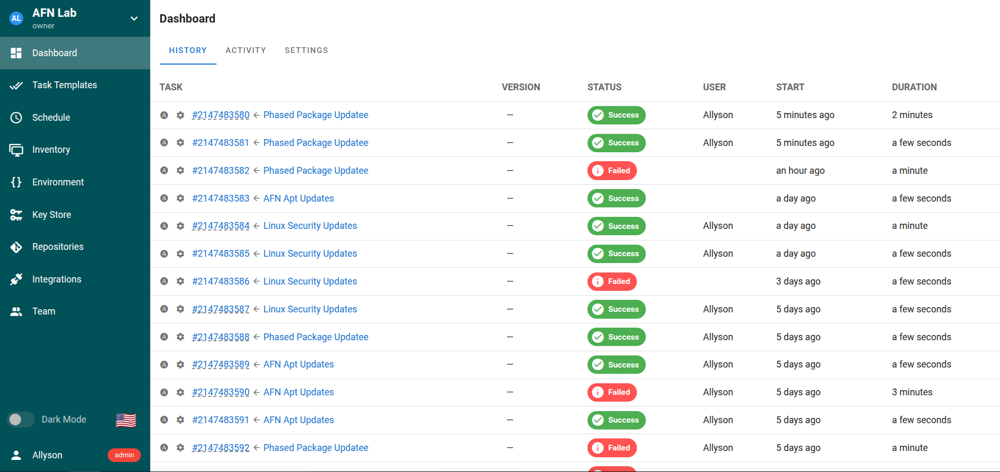
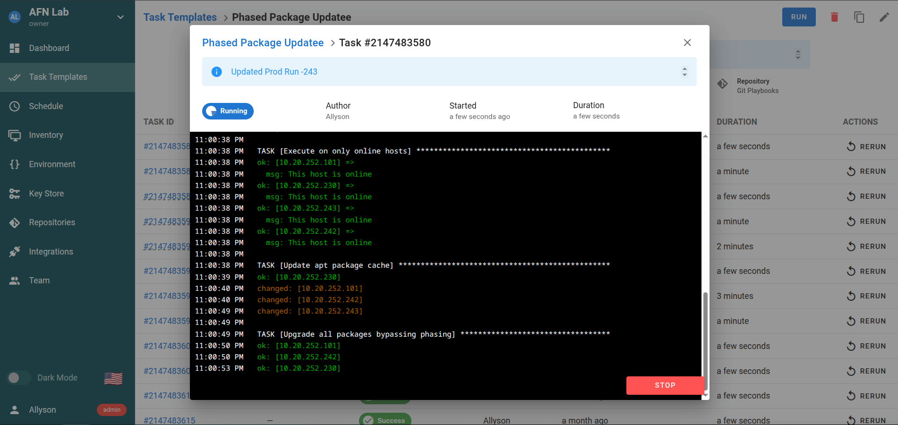

# Avid Tech Enthusiast - Homelab Owner and Developer
## Ansible Playbooks and Deployment
In this repository, I have built 3 yaml files which are coded for Ubuntu or Debian based APT updates via automation in ansible and Semaphore using Task and Schedules.  These are created using the standard anbible commands and will show status and updates and outcomes of the application command in the window using Semaphore or CLI.  Feel free to copy these for your homelab as a template. 
Over the next 6 months I will be advancing and integrating other playbooks to automate the management of Ubuntu or Debian based machines in my homelab. These can be used in your Homelab too! 

## Homelabs:
Homelabas are used for Tech Enthusiasts who enjoy automating technology in their homes.  This could involved Raspberry PI units, variety of Network Applicances, Small PC's, Servers and more. 

## About Me:

Spending alot of time working on my homelab and this repository and it's files are dedicated to creation, development and deployment of scripts and integrations to my Homelab. I'm a 25+ year experienced IT Saavant who enjoys all things tech.

## Current Build
* Network: Xfinity - 2.5GB Fiber to ONT
* ONT -> Ubiquiti USG 4 Pro Appliance -> US8 POE 60W -> Brocade ICX4630 24 Port -> RBK753 Orbi + MK73 Nighthawk + * AmplifiHD Ubiquiti Wifi
* Lenovo Thinkcentre M720T - i7 8th Gen 16GB RAM 256GB SSD - Proxmox PVE - Docker + Portainer - Ansible - AdGuard Home + Glances + Homarr + NetData
* HP 405 G6 - Ryzen 5 4650 32GB RAM 512GB SSD - Unifi Network OS Controller + Observium SNMP Monitoring
* Design and Control PC - Asus Pro B550 Wifi+ AX, AMD Ryzen 5 5600X, 32GB DDR4 RAM, WD+Samsung+TForce SSDs Total:    4TB, EVGA RTX3060Ti
* Design and Studio PC - Dell Precision 7530 i7 9th Gen, 32GB DDR4, nVidia P2000 Quadro GPU, 256GB NVME SSD Samsung Evo 980
* NAS: WDPR4100 with 4 Drives 8TB Storage + WD MyCloud 2TB (backups)

Pull requests are welcome. For major changes, please open an issue first
to discuss what you would like to change.

Please make sure to update tests as appropriate.

## Screenshots of Semaphore Using Playbooks:

